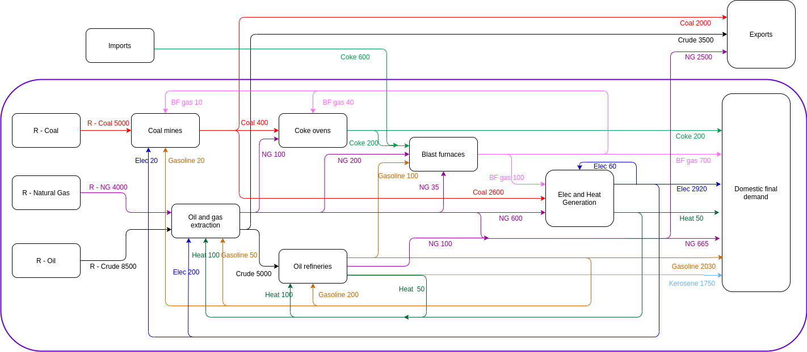

```{r, include = FALSE}
knitr::opts_chunk$set(
  collapse = TRUE,
  comment = "#>"
)
```

```{r setup, include = FALSE}
library(dplyr)
library(ECCTools)
```

# Introduction

The `R` package `ECCTools` provides tools to modify and Energy Conversion Chain (ECC) that has been previously loaded using the `R` package `IEATools`. The `IEATools` package helps to load IEA data as well as to sort and prepare IEA data to formulate a Physical Supply Use Table (see @Heun:2018). However, the `IEATools` package treats imports as a supplying industry, and to this extent, adopts what we refer here to as the Free Imports Assumption: imports come for free, with no upstream associated conversion chain (and hence, neither associated environmental burden nor embodied energy consumption).

The `ECCTools` package enables analysts to overcome this limitation through two different options:

1. The formulation of a Multi-Regional Physical Supply Use Table (MR-PSUT) framework representing the ECC. In this case, imports are treated as supply coming from an industry located in a different region. This option is the option closest to the reality of physical flows.
2. The formulation of a PSUT framework following the Domestic Technology Assumption (DTA). The DTA assumes that imports are produced within the region that imports them. Although the DTA is not a realistic assumption, it enables analysts to conduct useful simulations.


## Design philosophy

The package has been designed to be used as follows.

1. First, the IEA data needs to be loaded as usually done with the `IEATools` package. See the [IEATools](https://github.com/MatthewHeun/IEATools) package documentation.
2. Second, specific flows may be modified, for instance, to aggregate regions, to locate flows in a different matrix (in particular, to the newly introduced *balancing* matrix), or to perform any other modification.
3. Third, the overarching assumption of the PSUT may be modified, using one of the `transform_to_dta()`, `transform_to_gma()`, or `transform_to_bta()` functions.
4. Fourth, the actual PSUT matrices may be formulated using the `prep_psut()` function of the `IEATools` package.

Subsequent ECC analysis can be conducting using the `Recca` package. See the [Recca](https://github.com/MatthewHeun/Recca) package documentation.


## Available vignettes

The vignettes available for this package detail how to conduct the following tasks:

1.  *Using the balancing matrix*: Shows how to relocate flows into the newly defined balancing matrix and what the downstream consequences are.
2.  *Domestic Technology Assumption*: Shows how to formulate the Domestic Technology Assumptions and which conditions need to be fulfilled to formulate such an assumption.
3.  *Global Market Assumption*: Shows how to formulate the Global Market Assumption.
4.  *Bilateral Trade Assumption*: Shows how to provide bilateral trade data to formulate the Bilateral Trade Assumption.


## Demonstration example: the AB world

To illustrate how to use the package, we introduce a fictitious world consisting of two countries (A and B): welcome to the AB world! 

### Country A

The Energy Conversion Chain of country A is shown in the figure below:



As can be seen, the country A:

* Exports coal, crude oil, and natural gas to the rest of the world (so, to country B);
* Imports coke oven coke from the rest of the world (so, from country B);
* Presents a balanced ECC (supply = consumption).

### Country B

Next figure shows the Energy Conversion Chain of country B.


As can be seen, country B:

* Exports coke oven coke to the rest of the world (so, to country A);
* Imports coal, crude oil, and natural gas from the rest of the world (so, from country A);
* Presents a balanced ECC (supply = consumption).

### Global unbalances

So far so good. However, we note that although each domestic Energy Conversion Chain is balanced (supply = consumption), the global ECC resulting from the addition of both domestic ECCs is not. Indeed:

* Country A imports 600 ktoe of coke oven coke from the rest of the world, but country B (i.e.\ the rest of the world) only exports 400 ktoe! The world is in deficit of 200 ktoe. Where do they come from?
* Country B imports 3000 ktoe of crude oil from the rest of the world, but country A (i.e.\ the rest of the world) exports 3500 ktoe of crude oil. The world has a surplus of 500 ktoe of crude oil. Where is that energy going to?

The fact that these ECCs, when taken together, are unbalanced, is an attempt to represent faithfully the features of IEA data. Indeed, this type of unbalances appear when trying to build a global ECC from IEA data. Our AB world example will therefore show how such inconsistencies are dealt with when working with real IEA data.

Now, some guesses about why such inconsistencies may appear in IEA data:

* Incomplete world coverage. Some countries are not covered in IEA data. When these countries trade energy products with other countries, then that trade has to translate into a sink or source of energy products (provided the partner countries are covered in the IEA data), and hence in unbalances.
* Inconsistencies in national reporting of energy use. Indeed, energy consumption and production may be informal in many cases, and national statistical agencies may only be able to provide the IEA with best guess estimates. Such estimates allow for national ECCs to be balanced, but if the traded energy figures are not accurate, the incorrect estimates will translate into an energy product sink or source at the world level.
* Differences in energy products classification and naming between countries may also lead to discrepancies in the global figures of imported and exported figures. We note however that the IEA attempts to standardise the naming convention, but such errors remain likely, on a small scale.

Let's now have a look to the AB data organised in a `.tidy_iea_df` as provided by the `IEATools` package.

```{r}
# Fix product-level balances within each country
tidy_AB_data %>% 
  dplyr::glimpse()
```

We are now ready to get started with the following vignettes.
