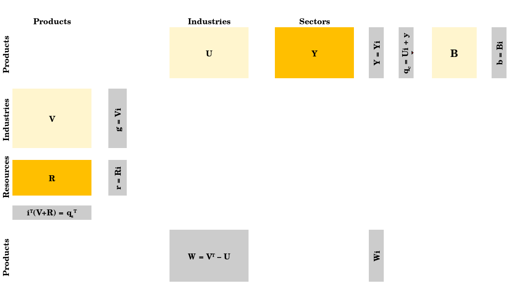

In this vignette we show how to use the balancing matrix **B** to modify the Energy Conversion Chain.

```{r setup, include = FALSE}
library(dplyr)
library(ECCTools)
```

# Introduction and use of the balancing matrix

## The balancing matrix

The balancing matrix is an extension of the original Physical Supply Use Table (PSUT) framework (see @Heun:2018) and has been introduced in @mr_psut_paper. The figure below shows the expanded PSUT framework with the balancing **B** matrix.



**Warning**: Before detailing further the use of the balancing matrix, the user needs to be aware that its use makes more complex the conduction of downstream Input-Output analysis (for instance with the `Recca` package). Indeed, by relocating flows to the balancing matrix, one is changing the definition of the matrices and vectors structuring the PSUT. Vectors may then be defined differently with a supply and with a consumption perspective. So, while the use of the **B** matrix may prove helpful, we recommend its use only if the implications of the given use are fully understood. We also recommend reading the paper that introduces the **B** matrix (@mr_psut_paper).

The **B** matrix enables analysts to:

-   modify the supply mix while conserving energy balance;
-   modify the final demand while conserving energy balance.

To scale up or down the supply of a given industry *i* by a factor $\lambda$, one can proceed according to the table below, extracted from @mr_psut_paper .


To modify the final demand without loosing energy balance, one can simply redirect energy flows belonging to the final demand (**Y** matrix) to the balancing matrix **B**.

## Using the balancing B matrix

### Initialising data

Let us use the AB world example introduced in the [Get started]() vignette, but let us add flows, so that:

1.  Statistical differences provide 100 ktoe of crude oil in country A. To keep balance between supply and use, we assume that these 100 ktoe are consumed by a submarine race organised in country A.
2.  Stock changes provide 400 ktoe of coke oven coke in country B. To keep balance between supply and use, we assume that these 400 ktoe are consumed by the organisation of large bonfires in country B, and that coke oven coke is an excellent fuel for bonfires.
3.  Stock changes consume 200 ktoe of coke oven coke in country A, which importations are actually 800 ktoe and not 600 ktoe! Hence that final demand contributes to the build-up of country A stocks, and will be used later on, when country A lacks coke oven coke.

```{r}
# Fix product-level balances within each country
tidy_AB_data_added_flows <- tidy_AB_data %>% 
  # First, adding statistical differences providing 100 ktoe of crude oil in country A:
  tibble::add_row(Country = "A", Method = "PCM", Energy.type = "E", Last.stage = "Final", Year = 2018, 
                  Ledger.side = "Supply", Flow.aggregation.point = "TFC compare", 
                  Flow = "Statistical differences", Product = "Crude oil", Unit = "ktoe", E.dot = 100) %>% 
  # Second, adding the submarine race organised in country A:
  tibble::add_row(Country = "A", Method = "PCM", Energy.type = "E", Last.stage = "Final", Year = 2018, 
                  Ledger.side = "Consumption", Flow.aggregation.point = "Industry", 
                  Flow = "Submarine race", Product = "Crude oil", Unit = "ktoe", E.dot = 100) %>% 
  # Third, adding the stock changes supplying 400 ktoe of coke oven coke in country B:
  tibble::add_row(Country = "B", Method = "PCM", Energy.type = "E", Last.stage = "Final", Year = 2018, 
                  Ledger.side = "Supply", Flow.aggregation.point = "Total primary energy supply", 
                  Flow = "Stock changes", Product = "Coke oven coke", Unit = "ktoe", E.dot = -400) %>% 
  # Fourth, adding the bonfire sessions in country B:
  tibble::add_row(Country = "B", Method = "PCM", Energy.type = "E", Last.stage = "Final", Year = 2018, 
                  Ledger.side = "Consumption", Flow.aggregation.point = "Industry", 
                  Flow = "Bonfires", Product = "Coke oven coke", Unit = "ktoe", E.dot = 400) %>% 
  # Fifth, adding stock build-up of 200 ktoe of coke oven coke in country A
  tibble::add_row(Country = "A", Method = "PCM", Energy.type = "E", Last.stage = "Final", Year = 2018, 
                  Ledger.side = "Supply", Flow.aggregation.point = "Total primary energy supply", 
                  Flow = "Stock changes", Product = "Coke oven coke", Unit = "ktoe", E.dot = 200) %>% 
  # Sixth, adding imports of 200 ktoe of coke oven coke by country A
  tibble::add_row(Country = "A", Method = "PCM", Energy.type = "E", Last.stage = "Final", Year = 2018, 
                  Ledger.side = "Supply", Flow.aggregation.point = "Total primary energy supply", 
                  Flow = "Imports [of Coke oven coke]", Product = "Coke oven coke", Unit = "ktoe", E.dot = 200) %>%
  dplyr::glimpse()
```

We can now verify that the adjusted ECC remains balanced:

```{r}
# Fix product-level balances within each country
tidy_AB_data_added_flows %>% 
  IEATools::calc_tidy_iea_df_balances() %>% 
  IEATools::tidy_iea_df_balanced()
```


### Relocating flows to balancing matrix

Now, let's assume that we want to modify the given ECC as follows:

1.  Statistical differences do not contribute to the supply mix in reality. The fact that some energy products are provided by statistical differences hides the upstream conversion processes associated to these energy products. Hence, we want to *remove statistical differences from the supply mix*.
2.  Stock changes may contribute to the supply mix in reality, in a given year. However, stock changes have been built (so, products have been produced) in previous years. Here we want to *remove stock changes from the supply mix* in order to simulate that the products drawn from stocks have been produced by the rest of the supply mix of the same year.
3.  Stock changes appearing as final consumption (200 ktoe of coke oven coke in country A) are not really part of the final energy consumption in the given year, rather, they will be consumed in later years. Hence, we want to *remove stock changes from the final consumption*.

**Note**: Statistical differences and stock changes will not necessarily need to be relocated to the balancing **B** matrix. This is an option available to the analyst that we use here as example, which may prove appropriate in some situations and for some purposes.

We will make use of the following functions:

* `IEATools::add_psut_matnames()` will add a column stating the matrix to which each flow belongs (function belonging to the `IEATools` package);
* `stat_diffs_to_balancing()` will move statistical difference flows, whether they are supply or use flows, to the balancing **B** matrix;
* `stock_changes_to_balancing()` will move stock changes flows, whether they are supply or use flows, to the balancing **B** matrix.

The code is as follows:

```{r}
tidy_AB_data_relocated_flows <- tidy_AB_data_added_flows %>% 
  IEATools::add_psut_matnames() %>% 
  stat_diffs_to_balancing() %>% 
  stock_changes_to_balancing() %>% 
  dplyr::glimpse()
```


Now, we can see that the Statistical differences and Stock changes flows belong to the balancing **B** matrix:

```{r}
tidy_AB_data_relocated_flows %>% 
  dplyr::filter(stringr::str_detect(Flow, "Statistical differences")) %>% 
  dplyr::glimpse()
```

and:

```{r}
tidy_AB_data_relocated_flows %>% 
  dplyr::filter(stringr::str_detect(Flow, "Stock changes")) %>% 
  dplyr::glimpse()
```

Finally, let's verify that the Energy Conversion Chain remains balanced once flows are relocated to the balancing **B** matrix:

```{r}
tidy_AB_data_relocated_flows %>% 
  IEATools::calc_tidy_iea_df_balances() %>% 
  IEATools::tidy_iea_df_balanced()
```

*Note regarding the sign convention in the balancing matrix*: Flow appearing as positive in the **B** matrix are akin to final demand flows. For instance, final demand flows relocated to **B** will be positive, a build-up in energy products stocks will be positive. Conversely, flows akin to supply will be registered as negative in **B**: for instance, flows removed from supply, energy products drawn from stocks, will all appear as negative values.

In conclusion, the analyst may use directly some functions directly available, such as `stat_diffs_to_balancing()` and `stock_changes_to_balancing()`. Alternatively, the analyst may directly relocate a flow to **B** by modifying the matrix name column of the flow that needs to be modified. Be careful with the sign convention!


## References
